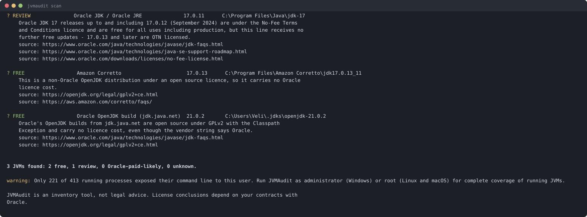

# JVMAudit

**Find every Java installation on a machine, see which ones are Oracle-licensed, and export
audit-ready evidence. Runs entirely offline.**

[](https://github.com/VeliAliyev/jvmaudit/actions/workflows/ci.yml)
[](LICENSE)

---

## Why this exists

Oracle licenses Java SE per **employee**, and its price list defines that as every full-time,
part-time and temporary employee *plus* every contractor, agent and consultant who supports your
internal business operations — **not** the number of people who use Java. Oracle's own published
example is a 28,000-employee company paying **$2,268,000 a year**
([Oracle Java SE Universal Subscription price list](https://www.oracle.com/a/ocom/docs/corporate/pricing/java-se-subscription-pricelist-5028356.pdf)).
Meanwhile the free window for Oracle JDK 21 closes with the **October 2026** Critical Patch Update,
after which its updates move to the paid OTN licence
([Oracle](https://blogs.oracle.com/java/post/jdk-21-approaches-end-of-permissive-license)).

None of that is a problem *if* you know what is installed. The difficulty is that you usually
don't: Oracle JDK and Oracle's own free OpenJDK build report the **same vendor string**, JREs get
bundled inside other companies' applications, and a Java 8 install often carries no vendor
information at all.

JVMAudit answers the question: **what Java is actually on this machine, and which of it is Oracle's?**

## Quickstart

You need Java 17 or later. If you don't have it, use the self-contained download below instead.

```sh
curl -LO https://github.com/VeliAliyev/jvmaudit/releases/latest/download/jvmaudit.jar
java -jar jvmaudit.jar scan
```



*Real output from a real machine.* Note the third row: Oracle's own OpenJDK build is **free**, and
JVMAudit says so, even though its vendor string is identical to the paid Oracle JDK above it.
Getting that distinction wrong in either direction is the whole problem.

### Downloads

| File | Needs | Use when |
| --- | --- | --- |
| `jvmaudit.jar` | Java 17+ already installed | you have Java, which you probably do |
| `jvmaudit-<version>-linux-x64.tar.gz` | nothing | no Java on the box, or you want it self-contained |
| `jvmaudit-<version>-macos-aarch64.tar.gz` | nothing | as above, Apple silicon |
| `jvmaudit-<version>-windows-x64.zip` | nothing | as above, Windows |

Every release ships `SHA256SUMS.txt`. Verify before you run anything on a production server:

```sh
sha256sum -c SHA256SUMS.txt --ignore-missing
```

The self-contained archives bundle their own runtime, built with `jlink` from Eclipse Temurin
(GPLv2 with the Classpath Exception). No Oracle-licensed code is shipped in any artifact here —
it would be a poor look for this tool in particular.

## Trust

This is a tool you are being asked to run as an administrator on production servers, so:

- **It makes no network requests. Ever.** Not for updates, not for rule data, not for telemetry.
  The licence rules are compiled into the binary. You can verify this: unplug the machine and run it.
- **It sends nothing anywhere.** There is no telemetry, no analytics, no callback, no usage ping.
- **It is Apache-2.0 and the source is here.** The detection code is
  [`core/src/main/java/dev/jvmaudit/core/detect`](core/src/main/java/dev/jvmaudit/core/detect),
  and every licence rule is a plain data file you can read:
  [`rules/oracle-license-rules.yaml`](rules/oracle-license-rules.yaml).
- **Every verdict cites its source.** Run `jvmaudit rules` to print the entire rule set with the
  Oracle document each rule came from, and `jvmaudit rules --unverified-only` to see the handful of
  rules that are our inference rather than a quotation from Oracle.
- **It only reads.** It never writes to, modifies, or removes a Java installation.

By default it runs `java -version` on installations it cannot otherwise identify, because that is
the only reliable way to separate Oracle JDK from Oracle OpenJDK. Pass `--no-probe` to forbid even
that; those installations will then be reported as `UNKNOWN` rather than guessed at.

## Catching an Oracle JDK that creeps back

Removing Oracle JDK once is easy. Keeping it gone is the hard part, because it comes back with a
new server image, a developer's convenience install, or a vendor's application update.

Scan on a schedule, keep the JSON, and diff:

```sh
#!/bin/sh
# /etc/cron.weekly/jvmaudit
set -e
state=/var/lib/jvmaudit
mkdir -p "$state"

jvmaudit scan --deep --format json --out "$state/today.json"

if [ -f "$state/last.json" ]; then
  jvmaudit diff "$state/last.json" "$state/today.json" --fail-on oracle \
    || mail -s "New Oracle-licensed Java on $(hostname)" ops@example.com < "$state/today.json"
fi

mv "$state/today.json" "$state/last.json"
```

`diff --fail-on oracle` exits 1 only when an Oracle-licensed installation **appears**, or an
existing one moves to a paid licence. It stays quiet for ordinary version bumps, so the alert keeps
meaning something.

In CI, fail the build instead:

```sh
jvmaudit scan --fail-on oracle-paid   # exit 1 if anything most likely needs a paid licence
```

Exit codes: `0` clean, `1` matched `--fail-on`, `2` the scan itself failed.

## Evidence pack

```sh
jvmaudit scan --deep --evidence evidence.zip
```

Produces a zip holding the findings (JSON and CSV), a self-contained HTML report, verbatim copies
of the exact licence rules used, and a `manifest.json` of SHA-256 hashes. It is meant to be handed
to a lawyer, a consultant, or Oracle.

**What the manifest proves:** the files have not been altered since the pack was generated.
**What it does not prove:** who generated it, on which machine, or when. There is no signature and
no trusted timestamp. That limitation is written inside the pack itself, not just here.

## What it finds, and what it misses

**Finds**, and merges into one entry per installation:

- the conventional install directories for Windows, macOS and Linux
- SDKMAN, asdf, jenv, mise, JetBrains `.jdks`, Gradle `jdks`, Homebrew, scoop, snap
- `JAVA_HOME`, `JDK_HOME`, `JRE_HOME` and every `java` on `PATH`
- the Windows registry, including the 32-bit view
- JVMs that are **running right now**
- with `--deep`, JVMs bundled inside other applications — which is where forgotten Oracle JREs live

**Misses**, honestly:

- **Other users' processes, without elevation.** Run as administrator or root for full coverage.
  The report tells you when it could only see some of them.
- **Containers.** A running container's JVMs are not visible from the host, and JVMAudit does not
  open image layers. `--deep` will walk a mounted container filesystem. Proper container support is
  the most-requested thing and is planned.
- **Remote and network filesystems**, which `--deep` skips by default for speed.
- **An installation that identifies itself as nothing at all.** Some Java 8 builds — BellSoft
  Liberica 8, for one — carry no vendor field and no vendor name in their banner. JVMAudit reports
  these `UNKNOWN` and tells you what to look at, rather than guessing.

> **JVMAudit is an inventory tool, not legal advice.** Whether you owe Oracle anything depends on
> your contracts with Oracle, which this tool cannot see. Every finding cites the Oracle document
> behind it so you and your advisers can check the reasoning.

## FAQ

**We only use Temurin / Corretto / Zulu. Are we fine?**
Probably, and JVMAudit will confirm it in about a second — that is a good reason to run it. Those
distributions are open source and carry no Oracle licence cost. The value is in proving it, and in
catching the Oracle JDK somebody installed on one build agent two years ago.

**What are NFTC and OTN?**
Two Oracle licences. **NFTC** (No-Fee Terms and Conditions) permits free use including in
production. **OTN** permits free use only for personal use, development, testing, prototyping and
demonstration — commercial and production use needs a paid subscription. Which one applies depends
on the exact version and build date. Oracle JDK 17.0.12 is NFTC; 17.0.13 is OTN. That single update
is the difference.

**Oracle JDK and Oracle OpenJDK look identical. How do you tell them apart?**
Both report `IMPLEMENTOR="Oracle Corporation"`. JVMAudit runs `java -version` and looks for
`Java(TM)`, which only the commercial build prints. It can also tell them apart *without* running
anything, using two signals validated against seven real Oracle releases: an Oracle JDK's `SOURCE`
field carries a second `open:git:` component, and it ships the NFTC or OTN licence text where the
free build ships GPLv2. When neither method settles it, the answer is `UNKNOWN` — never a guess.

**We found an Oracle JRE inside a vendor's application. Do we owe money?**
Possibly not. The application vendor's own agreement with Oracle may cover it — this is common for
software that embeds a JRE. JVMAudit flags these as bundled and tells you to check with that
vendor. It will never tell you that you owe money.

**Does it phone home?**
No. See [Trust](#trust).

**Can I trust a licence verdict?**
Check it. Every one carries the Oracle URL it came from, `jvmaudit rules` prints the full rule set,
and `jvmaudit rules --unverified-only` lists the rules that are our inference rather than Oracle's
own words. Where Oracle has not published something, JVMAudit says so instead of filling the gap.

## Building from source

```sh
git clone https://github.com/VeliAliyev/jvmaudit.git
cd jvmaudit
mvn verify                      # runs the full test suite
java -jar cli/target/jvmaudit.jar scan
```

Java 21 to build; the result runs on Java 17+. See [CONTRIBUTING.md](CONTRIBUTING.md).

## Licence

Apache-2.0. See [LICENSE](LICENSE).
